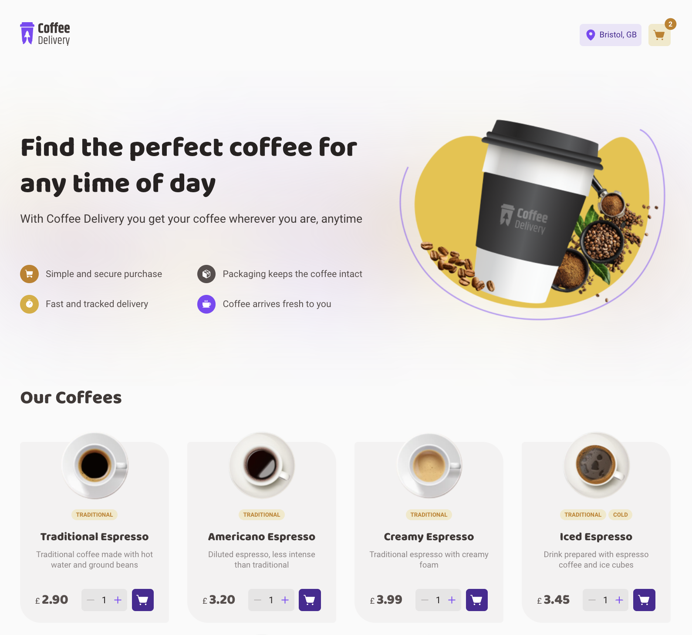

# Coffee Delivery app

## Table of contents

- [The project](#the-project)
- [Screenshot](#screenshot)
- [Links](#links)
- [Built with](#built-with)
- [Project setup](#project-setup)

## The project

Application to manage a shopping basket of a fictional coffee shop, which contains the following functionalities:

- List of products (coffees) available for purchase
- Add a specific quantity of items to the basket
- Increase or remove the number of items in the basket
- Form for the user to fill in their address
- Display in the Header the number of items in the basket
- Display the total number of items in the basket multiplied by the amount
- Give user feedback when:
    - an item is added to the basket
    - invalid quantity is entered in the product form
    - limit of a single product added to the basket has been reached
    - form is invalid

Covered concepts:

- States
- ContextAPI
- Geocoding
- LocalStorage
- State immutability
- Lists and keys in ReactJS
- Properties
- React Hooks
- Componentization

## Screenshot



## Links

- Live demo: [https://rct-coffee-delivery.netlify.app/](https://rct-coffee-delivery.netlify.app/)

## Built with

- Vite
- ReactJS
- TypeScript
- Radix
- React Hook Form
- Zod (validation)
- React Router
- Styled-components

## Project setup
```
npm install
```

### Start dev server
```
npm run dev
```

### Build for production
```
npm run build
```

### Locally preview production build
```
npm run preview
```

### Lint files
```
npm run lint
```